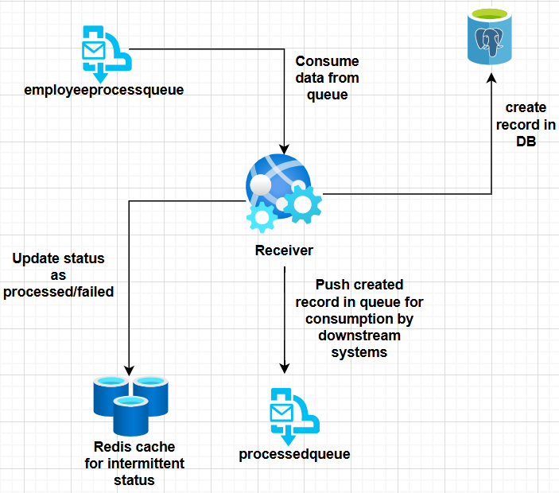

# 📩 Service Bus Receiver — Message-Based Architecture (Spring Boot + Azure)

This service is the **receiver/consumer** in a simple message-based architecture.  
It listens to an Azure Service Bus queue for incoming **employee details**, processes and persists them in **Azure PostgreSQL**, updates **Redis** for status tracking, and then **publishes the processed employee record (including its `employeeId`) to the `processedqueue`** for downstream systems.

---

## 🏗️ Role in the System

1. Consume messages from **`employeeprocessqueue`**.
2. Deserialize payload (employee details) → validate → **save to PostgreSQL**.
3. Update **Redis** status: `processing` → `processed` / `failed`.
4. Publish the **processed employee record (with `employeeId`)** to **`processedqueue`**.

> Note: This service exposes no public REST endpoints; it runs as a background listener.


---

## 🖼️ System Architecture

The **Receiver Microservice** is a key component in the message-based architecture.  
It consumes messages from **Azure Service Bus**, processes them, persists data to **PostgreSQL**, updates **Redis** cache for real-time status tracking, and publishes processed records for downstream systems.



---

## 🔑 Key Components

| Component | Purpose |
|---|---|
| `QueueListener` | Subscribes to `employeeprocessqueue`, triggers processing and publishing to `processedqueue`. |
| `ServiceBusConfig` | Configures Service Bus clients with Managed Identity. |
| `DbConfig` | PostgreSQL connectivity (token-based via Managed Identity). |
| `RedisConfig` | Redis connection and templates for status caching. |
| `BasicDetailsRepository` | JPA repository for persisting employee records. |
| `ServiceBusProcessedMsg` | DTO published to `processedqueue` containing processed employee details (incl. `employeeId`). |

---

## ☁️ Azure Integration & Auth

- **Service Bus**: Managed Identity (`DefaultAzureCredential`)  
  - Receive from **`employeeprocessqueue`**  
  - Send to **`processedqueue`**
- **PostgreSQL**: Managed Identity (token-based JDBC)
- **Redis**: **Key-based** auth (Managed Identity available only in Premium tier)

**Config example:**
```properties
# Service Bus
spring.cloud.azure.servicebus.namespace=<namespace>
spring.cloud.azure.servicebus.credential.managed-identity-enabled=true

# PostgreSQL (Managed Identity)
spring.datasource.url=jdbc:postgresql://<server>.postgres.database.azure.com:5432/<db>
spring.datasource.username=<managed_identity_user>
spring.datasource.authentication=ActiveDirectoryManagedIdentity

# Redis (key-based)
spring.data.redis.host=<redis-name>.redis.cache.windows.net
spring.data.redis.port=6380
spring.data.redis.password=${REDIS_ACCESS_KEY}
spring.data.redis.ssl=true


